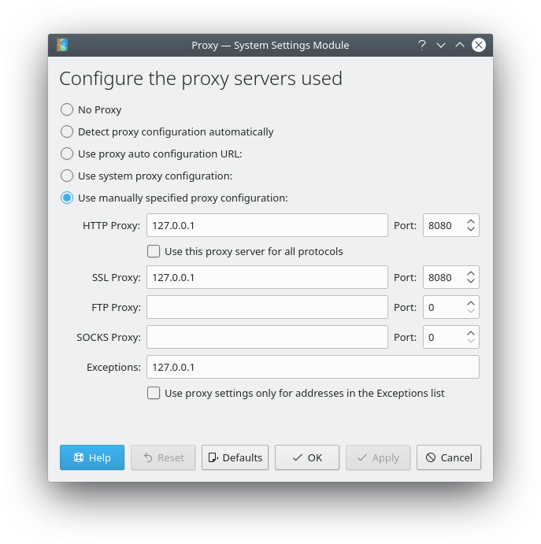
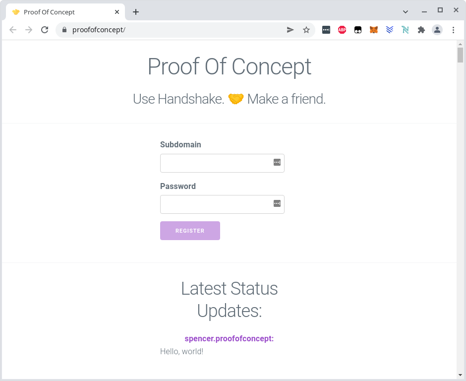
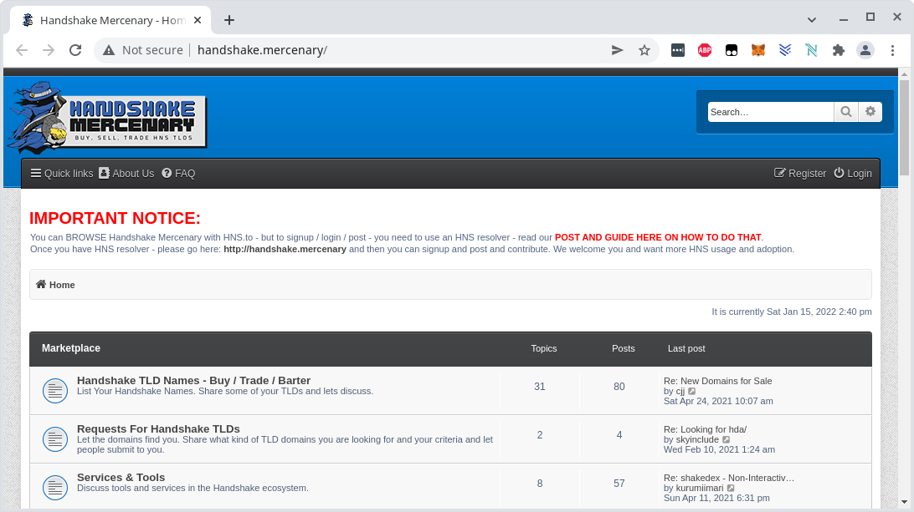

# Using the Handshake main net
We are using the HSD full node and the letsdane program to resolve TLDs from the Handshake blockchain.

## Build and run a HSD full node
Build and run HSD as described in the README page of the project:

```
git clone https://github.com/handshake-org/hsd.git
cd hsd
npm install --production
./bin/hsd --rs-host 0.0.0.0 --rs-port 5350
```

This needs a few hours until the blockchain is fully synched, and it needs about 14 GB in the `~/.hsd` directory. See https://blockexplorer.com for the current latest block. It is done when you see the block in the debug output:

```
[debug] (wallet) Adding block: 102948.
```

If there are build problems, probably some libraries are missing. You need to install NodeJS and a few other libraries. For example on a Debian system I had to install this:

```
sudo apt-get install npm libunbound-dev libcap2-bin
npm install -g node-gyp
```

## Build and run letsdane
Build it as explained in the README page of the project:
```
git clone https://github.com/buffrr/letsdane
cd letsdane/cmd/letsdane/
go build -tags unbound
```

If there are build problems, there might be some packages missing, for example:

```
sudo apt-get install libunbound-dev
```

And it needs Go, see https://go.dev/doc/install how to install it.

After building, you need to export a certificate for your browser:

```
./letsdane -o myca.crt
```

Then you need to import the certificate in your browser. See for example [here](https://docs.vmware.com/en/VMware-Adapter-for-SAP-Landscape-Management/2.1.0/Installation-and-Administration-Guide-for-VLA-Administrators/GUID-D60F08AD-6E54-4959-A272-458D08B8B038.html) how to add it to Chrome.

Letsdane implements a proxy server for the name resolution and SSL wrapping. It uses the HSD recursive nameserver to resolv names. Start it like this:

```
./letsdane -r 127.0.0.1:5350 -skip-dnssec -skip-icann
```

Then you need to setup the proxy in the operating system. For example in Debian Linux open the proxy settings and configure it like this:



After changing the proxy settings, restart your browser, and you will be able to resolv handshake domains. Example with SSL encryption and just the TLD: https://proofofconcept



Another example of a forum with a subdomain and no SSL: http://handshake.mercenary



# Create your own Handshake test network

To run your own Handshake network, we are using a local regtest network of Handshake (currently there is no running global testnet). We also need to install our own nameserver.

## Install the Bind9 nameserver

Install the nameserver daemon like this:

```
sudo apt-get install bind9
```

To verify that it runs, query a domain:

```
dig @127.0.0.1 google.com
```

It automatically caches the result. So for the first query it might need 20 ms or longer, depending on your Internet ping time, and then subsequent queries are done in 1 ms:

```
...
;; Query time: 1 msec
;; SERVER: 127.0.0.1#53(127.0.0.1)
;; WHEN: Sat Jan 15 14:36:21 CET 2022
;; MSG SIZE  rcvd: 929
```

**TODO**

## Create a name on the regtest blockchain
test.sh

## Create and set the nameserver records for the name
```
# set a DNSSEC record
# created by https://github.com/pinheadmz/handout/tree/proofofconcept and running this command:
# node scripts/hnssec-gen.js metaroot 127.0.0.1
hsw-rpc sendupdate "$name" '{"records":[{"type":"GLUE4","ns":"ns.metaroot.","address":"127.0.0.1"},{"type":"DS","keyTag":53462,"algorithm":8,"digestType":2,"digest":"1b019a8b90cd44222dfc3df2ec9d571c1338a5c772837f3f125ffc4ec1a5dbbc"}]}' > /dev/null
mine 10

# show the record
echo "record on the blockchain:"
hsd-rpc getnameresource "$name"

# show nameserver output
dig @127.0.0.1 -p 25350 "$name" +dnssec
```

## Setup and run a local webserver over SSL
Python script:
```
import http.server, ssl

server_address = ('localhost', 4443)
httpd = http.server.HTTPServer(server_address, http.server.SimpleHTTPRequestHandler)
httpd.socket = ssl.wrap_socket(httpd.socket,
                               server_side=True,
                               certfile='localhost.pem',
                               ssl_version=ssl.PROTOCOL_TLS)
httpd.serve_forever()
```
TODO: create localhost.pem certificate
