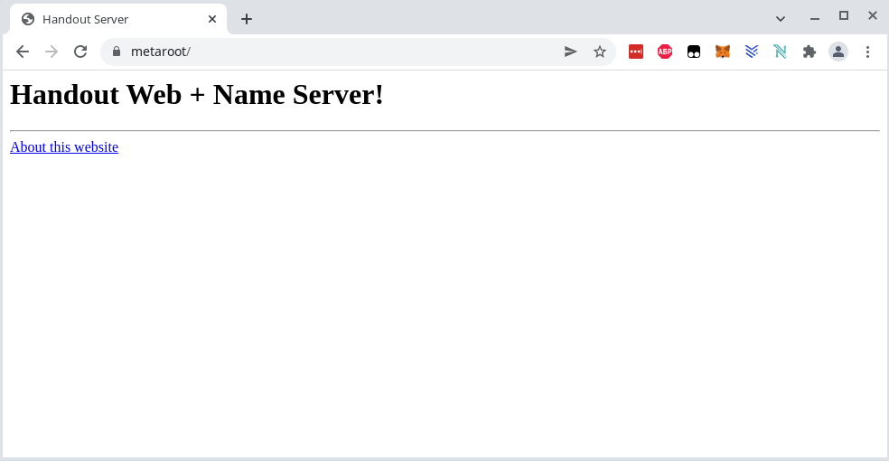

# Using the Handshake main net
We are using the HSD full node and the letsdane program to resolve TLDs from the Handshake blockchain.

## Build and run a HSD full node
The following was tested with the latest stable version of NodeJS. `node --version` showed `v16.13.2`.

Build and run HSD as described in the README page of the project:

```
git clone https://github.com/handshake-org/hsd.git
cd hsd
npm install --production
./bin/hsd --rs-host 0.0.0.0 --rs-port 5350
```

This needs a few hours until the blockchain is fully synched, and it needs about 14 GB in the `~/.hsd` directory. See https://blockexplorer.com for the current latest block. It is done when you see the block in the debug output:

```
[debug] (wallet) Adding block: 102948.
```

If there are build problems, probably some libraries are missing. You need to install NodeJS and a few other libraries. For example on a Debian system I had to install this:

```
sudo apt-get install npm libunbound-dev libcap2-bin
npm install -g node-gyp
```

## Build and run letsdane
Build it as explained in the README page of the project:

```
git clone https://github.com/buffrr/letsdane
cd letsdane/cmd/letsdane/
go build -tags unbound
```

If there are build problems, there might be some packages missing, for example:

```
sudo apt-get install libunbound-dev
```

And it needs Go, see https://go.dev/doc/install how to install it.

After building, you need to export a certificate for your browser:

```
./letsdane -o myca.crt
```

Then you need to import the certificate in your browser. See for example [here](https://docs.vmware.com/en/VMware-Adapter-for-SAP-Landscape-Management/2.1.0/Installation-and-Administration-Guide-for-VLA-Administrators/GUID-D60F08AD-6E54-4959-A272-458D08B8B038.html) how to add it to Chrome.

Letsdane implements a proxy server for the name resolution and SSL wrapping. It uses the HSD recursive nameserver to resolv names. Start it like this:

```
./letsdane -r 127.0.0.1:5350 -skip-dnssec -skip-icann
```

Then you need to setup the proxy in the operating system. For example in Debian Linux open the proxy settings and configure it like this:


After changing the proxy settings, restart your browser, and you will be able to resolv handshake domains. Example with SSL encryption and just the TLD: https://proofofconcept


Another example of a forum with a subdomain and no SSL: http://handshake.mercenary


# Create your own Handshake test network

To run your own Handshake network, we are using a local regtest network of Handshake (currently there is no running global testnet). We also need to install our own nameserver.

## Create a name on the regtest blockchain
Change to the hsd directory, then start the test.sh script in this directory, but with the leading `.`, to define all variables in the current shell:

```
cd hsd
. ../handshake-test/test.sh
```

Output should be like this:

```
hsd: no process found
starting server
receive address: rs1qesjl778cv5g0fn5gpahaw4cxz22e7wz7jp9lt4
mining coins
name: metaroot
blocks until auction starts: 6
blocks until auction reveal: 4
blocks until auction close: 9
```

After this, the hsd full node program is running the regtest network, with the root nameserver at port 25349, and the recursive server at port 25350.

## Create the nameserver records for the name
The repository https://github.com/pinheadmz/handout has anything you need to create the DNS records for the DNSSEC nameserver, and it provides a DNSSEC aware nameserver and a secure webserver. Open a new terminal, clone the project and checkout the `proofofconcept` branch, and install it:

```
git clone -b proofofconcept https://github.com/pinheadmz/handout
cd handout
npm i
```

You can create the certificates and DNSSEC records for the TLD `metaroot` like this:

```
node scripts/hnssec-gen.js metaroot 127.0.0.1
```

The output should looks like this (the digest can vary) :

```
Generating SSL key and self-signed certificate...

Generating DNSSEC keys...

Writing new conf/handout.conf...

DS record for root zone:
metaroot. 172800 IN DS 19927 8 2 7F80DE0EDEBC345F27B3FE9E16EA2FD2B50F5E6353DF9C82A3EF7E65 E660BF57  ; alg = RSASHA256 ; hash = SHA256

GLUE4 record, Bob format:
ns.metaroot. 127.0.0.1

DS record, Bob format:
19927 8 2 7f80de0edebc345f27b3fe9e16ea2fd2b50f5e6353df9c82a3ef7e65e660bf57

All records, hsw-rpc sendupdate format:
{"records":[{"type":"GLUE4","ns":"ns.metaroot.","address":"127.0.0.1"},{"type":"DS","keyTag":19927,"algorithm":8,"digestType":2,"digest":"7f80de0edebc345f27b3fe9e16ea2fd2b50f5e6353df9c82a3ef7e65e660bf57"}]}
```

In the HSD terminal, you can now set the DNSSEC record. This stores the digest to validate the record in the regtest blockchain:

```
hsw-rpc sendupdate "$name" '{"records":[{"type":"GLUE4","ns":"ns.metaroot.","address":"127.0.0.1"},{"type":"DS","keyTag":19927,"algorithm":8,"digestType":2,"digest":"7f80de0edebc345f27b3fe9e16ea2fd2b50f5e6353df9c82a3ef7e65e660bf57"}]}'
mine 10
```

The `mine 10` command mines 10 blocks, which is required to make the new record active.

Verify that the record was set:

```
hsd-rpc getnameresource "$name"
```

Output:

```
{
  "records": [
    {
      "type": "GLUE4",
      "ns": "ns.metaroot.",
      "address": "127.0.0.1"
    },
    {
      "type": "DS",
      "keyTag": 11326,
      "algorithm": 8,
      "digestType": 2,
      "digest": "8b167d1e80c9ec5af014150906ce13fef41e33ce030794a886781de749ba37ab"
    }
  ]
}
```

Now start the nameserver and webserver in the handout terminal. Since this nameserver is bind to port 53, first you need to allow `node` programs to open ports below 1024 like this:

```
sudo setcap cap_net_bind_service=ep `which node`
```

Now you can start it:

```
node lib/handout.js
```

Output:
```
[debug] (webserver) Webserver opened at host 127.0.0.1
[debug] (authns) Authoritative Nameserver opened for domain metaroot.
```

You can query the root nameserver of the handout script like this:

```
dig @127.0.0.1 metaroot +dnssec
```

Output:

```
; <<>> DiG 9.11.5-P4-5.1+deb10u6-Debian <<>> @127.0.0.1 metaroot +dnssec
; (1 server found)
;; global options: +cmd
;; Got answer:
;; ->>HEADER<<- opcode: QUERY, status: NOERROR, id: 14846
;; flags: qr aa rd; QUERY: 1, ANSWER: 2, AUTHORITY: 0, ADDITIONAL: 1
;; WARNING: recursion requested but not available

;; OPT PSEUDOSECTION:
; EDNS: version: 0, flags: do; udp: 4096
;; QUESTION SECTION:
;metaroot.                      IN      A

;; ANSWER SECTION:
metaroot.               21600   IN      A       127.0.0.1
metaroot.               172800  IN      RRSIG   A 8 1 21600 20230124034412 20220123034412 53535 metaroot. dnah5tahMvwomU1Ig4DqdiJo/Sopk4N0X/IVmpASBf/RdfxtUQ85W7pG V1c2+V33v4lf1rOmYbP6dXqCGLZKXQ+jdR/wUIsshP0W0EX2o5y+RUrF Lsw43XQYAB1guWmSFf7M5g8nYf3xBoXlGsEOOJ5r0IS2Zr8cpTo48RD4 KcuMvd4MvL9f6/SC/LqIX0+uVsiXPAO0CuwFvfXX/mtn65OQ+GJrJFNy e8unX532HaRqeqlNBhOX0SAmKwhcC0KhVKpMWlCwZFBRB5VdvKD57o7L 73XbXomcYSn1+6T74iPudUIVnhePfvl/V9EEnR02qRdb9/ESrnfOLZck 9vdo5Q==

;; Query time: 0 msec
;; SERVER: 127.0.0.1#53(127.0.0.1)
;; WHEN: Mon Jan 24 05:03:59 CET 2022
;; MSG SIZE  rcvd: 341
```

The integrated recursive nameserver of the HSD full node can be queried like this, and it uses the handout root nameserver:

```
dig @127.0.0.1 -p 25350 "$name" +dnssec
```

Output:

```
; <<>> DiG 9.11.5-P4-5.1+deb10u6-Debian <<>> @127.0.0.1 -p 25350 metaroot +dnssec
; (1 server found)
;; global options: +cmd
;; Got answer:
;; ->>HEADER<<- opcode: QUERY, status: NOERROR, id: 46865
;; flags: qr rd ra ad; QUERY: 1, ANSWER: 2, AUTHORITY: 0, ADDITIONAL: 2

;; OPT PSEUDOSECTION:
; EDNS: version: 0, flags: do; udp: 4096
; COOKIE: 24303290fd6e251e (echoed)
;; QUESTION SECTION:
;metaroot.                      IN      A

;; ANSWER SECTION:
metaroot.               20358   IN      A       127.0.0.1
metaroot.               85158   IN      RRSIG   A 8 1 21600 20230124034412 20220123034412 53535 metaroot. dnah5tahMvwomU1Ig4DqdiJo/Sopk4N0X/IVmpASBf/RdfxtUQ85W7pG V1c2+V33v4lf1rOmYbP6dXqCGLZKXQ+jdR/wUIsshP0W0EX2o5y+RUrF Lsw43XQYAB1guWmSFf7M5g8nYf3xBoXlGsEOOJ5r0IS2Zr8cpTo48RD4 KcuMvd4MvL9f6/SC/LqIX0+uVsiXPAO0CuwFvfXX/mtn65OQ+GJrJFNy e8unX532HaRqeqlNBhOX0SAmKwhcC0KhVKpMWlCwZFBRB5VdvKD57o7L 73XbXomcYSn1+6T74iPudUIVnhePfvl/V9EEnR02qRdb9/ESrnfOLZck 9vdo5Q==

;; SIG0 PSEUDOSECTION:
.                       0       ANY     SIG     0 253 0 0 20220124100505 20220123220505 64595 . NSDF0WIJytT6NxBJT5rcg5UAY1beyh+TBCv/Z3DUKw4H5bomJkb+OXHz A1Xt5ce/ZBxG7xGmh+2/ICgX3xhSWA==

;; Query time: 3 msec
;; SERVER: 127.0.0.1#25350(127.0.0.1)
;; WHEN: Mon Jan 24 05:05:05 CET 2022
;; MSG SIZE  rcvd: 447
```

Finally restart letsdane with the new recursive nameserver:

```
./letsdane -r 127.0.0.1:25350 -skip-dnssec -skip-icann
```

Now you can open https://metaroot and it should look like this:


